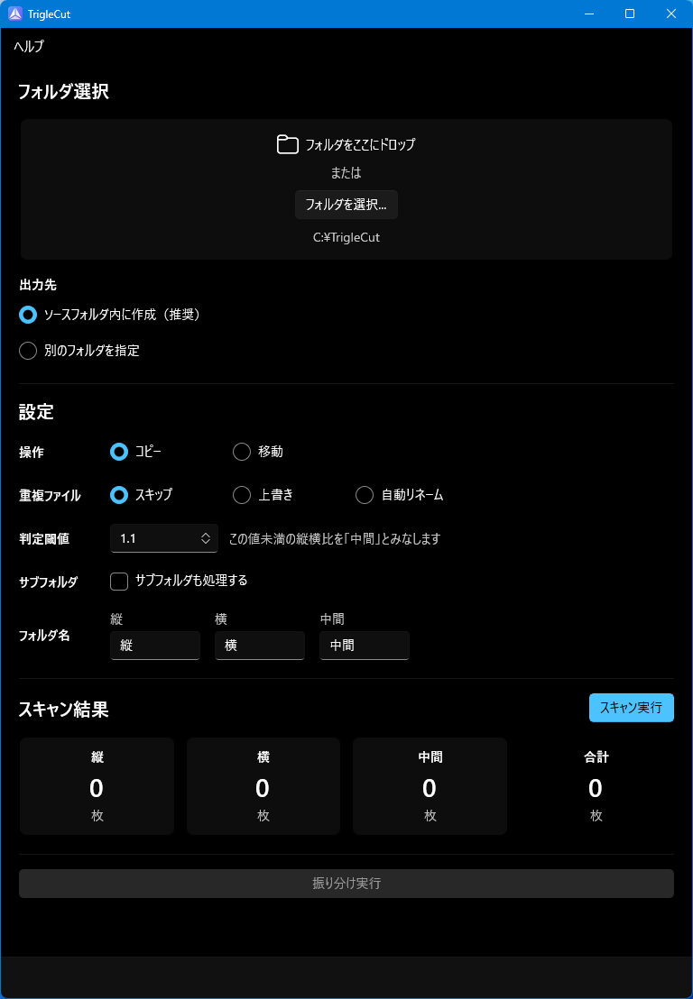
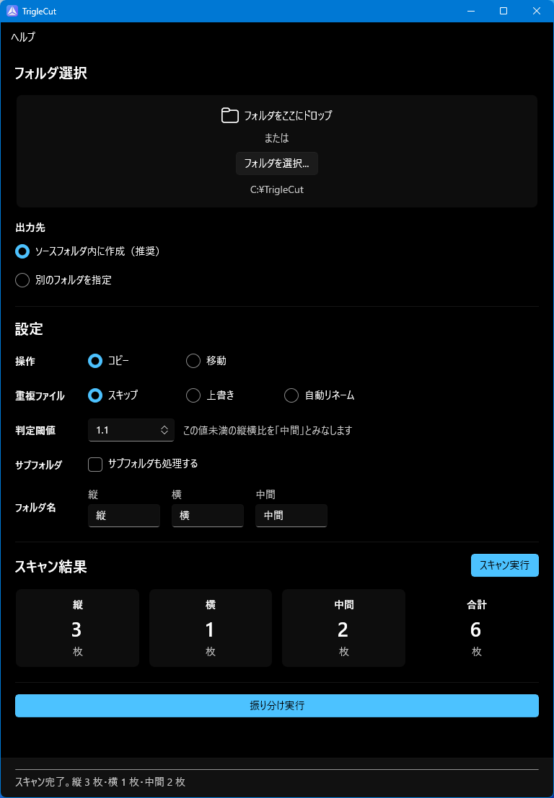

# TrigleCut

画像ファイルを**縦・横・中間**に自動で振り分けるWindows用ツールです。

---

## スクリーンショット

<p align="center">
  
  
</p>

---

## 機能

- フォルダ内の画像を縦横比で自動分類（縦 / 横 / 中間）
- EXIF回転情報を考慮した正確な判定（スマホ写真対応）
- コピーまたは移動を選択可能
- 重複ファイルの処理方法を選択（スキップ / 上書き / 自動リネーム）
- サブフォルダの再帰処理
- 出力先フォルダ名のカスタマイズ
- 振り分け先フォルダの個別指定
- 処理中のキャンセル対応
- エラー発生時のアプリ内通知

**対応形式:** JPEG / PNG / WebP / BMP / GIF / TIFF / HEIC・HEIF（※）

> ※ HEIC/HEIF はWindows の「HEIFイメージ拡張機能」コーデックが必要です。

---

## 動作環境

| 項目 | 要件 |
|------|------|
| OS | Windows 10 (1809以降) / Windows 11 |
| アーキテクチャ | x64 |
| ランタイム | **Windows App SDK 2.x ランタイム**（別途インストール必要） |

> .NET ランタイムは同梱済みのため別途インストール不要です。

---

## インストール方法

### 1. Windows App SDK ランタイムをインストール

TrigleCut の実行には Windows App SDK ランタイムが必要です。

**インストーラーのダウンロード:**
1. [Windows App SDK リリースページ](https://learn.microsoft.com/ja-jp/windows/apps/windows-app-sdk/downloads) を開く
2. 「バージョン 2.x」の **x64 インストーラー** (`WindowsAppRuntimeInstall-x64.exe`) をダウンロード
3. 実行してインストール

> Windows 11 や最新のアプリをインストール済みの環境では、すでに入っている場合があります。

### 2. TrigleCut を展開して起動

1. `TrigleCut-v1.0.0.zip` を任意のフォルダに展開
2. `TrigleCut.exe` を実行

インストール不要です。フォルダごとどこに置いても動作します。

### ⚠️ SmartScreen の警告が出た場合

初回起動時に「Windows によって PC が保護されました」という画面が表示されることがあります。  
これはコード署名なしの exe を実行した際に Windows が表示する警告で、TrigleCut 固有の問題ではありません。

**手順:**
1. 「詳細情報」をクリック
2. 「実行」ボタンをクリック

> **原因:** 有料のコード署名証明書を取得していないため、Windows が発行元を確認できない状態です。  
> ダウンロード直後の exe のみ警告が出ます。一度許可すると次回以降は表示されません。

---

## 使い方

1. **フォルダ選択** — 「フォルダを選択...」ボタンまたはドラッグ＆ドロップで対象フォルダを指定
2. **設定** — 操作（コピー/移動）、重複処理、判定閾値などを設定
3. **スキャン実行** — フォルダ内の画像を分析して枚数を確認
4. **振り分け実行** — 設定に従って画像を振り分け

処理中はボタンが「キャンセル」に変わります。

> **判定閾値について**  
> 縦横比（長辺 ÷ 短辺）が閾値未満の画像を「中間」に分類します。1.0 が完全な正方形で、初期値 1.1 はほとんどの場合そのまま使えます。中間が多すぎる場合は小さく、縦/横のはずの画像が中間に入る場合は大きくしてください。

---

## データの保存場所

| 種類 | 場所 |
|------|------|
| 設定ファイル | `%LocalAppData%\TrigleCut\settings.json` |
| エラーログ | `%LocalAppData%\TrigleCut\logs\` |

ログはアプリ内「ヘルプ → ログフォルダを開く」から確認できます。

---

## 配布用ビルド手順（開発者向け）

```
dotnet publish TrigleCut/TrigleCut.csproj -c Release -r win-x64 -o publish/
```

出力先 `publish/` フォルダの中身を zip にして配布してください。

---

## バージョン履歴

### v1.0.0
- 初回リリース
